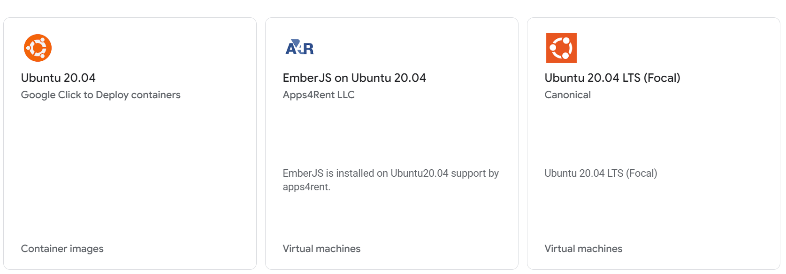

# Creating a VM Instance on Google Cloud

## Step 1: Register a free account with $300 bonus for new customers

You can complete your free registration from the Google website [here](https://cloud.google.com/free?utm_source=google&utm_medium=cpc&utm_campaign=Cloud-SS-DR-GCP-1713658-GCP-DR-NA-US-en-Google-BKWS-EXA-GeneralGCP&utm_content=c-Hybrid+%7C+BKWS+-+EXA+%7C+Txt-Generic+Cloud-Cloud+Generic-Cloud+Generic-6458750523&utm_term=google%20cloud&gclsrc=aw.ds&gad_source=1&gad_campaignid=23752515549&gclid=CjwKCAjwhZDUBhBGEiwAbi5bjkO1ry1Jx-hTk80lTEPQsbhVCPV-QtHbElYYPBFAQtrTU4LRYsKcnRoCopMQAvD_BwE). 

## Step 2: Create a VM instance 

<mark>Note:<mark> When you create the VM instance, a configuration of 2 vCPU and 4GB of memory is more desirable. However, 
1 vCPU and 2GB is sufficient for most labs in CSC4222 Secure Software Engineering. You can
easily change the machine configuration later after the machine
is created. 

- In the navigation menu, click "Marketplace". In the Marketplace, search for Ubuntu 20.04. You will find two versions. Choose the Ubuntu 20.04 LTS (Focal), then click "launch".


- You will come to the Machine Configuration. 


## Step 3: Machine Configuration


## Step 2: Boot disk 

Choose the Ubuntu 20.04 LTS operating system.
For the disk size, 20 GB is more desirable, but 10 GB is 
sufficient (you may have to do some cleanup if the disk
becomes full).


## Step 3: Set up Firewall Rules

You need to set up firewall rules, so you can connect to the VM from the 
outside. You can find detailed instructions from 
the [official Google document](https://cloud.google.com/vpc/docs/firewalls) 
and other online tutorials. 
There are two essential rules that we need to set, one for SSH (which is 
usually already set by the cloud), and the other is for VNC.
Their port numbers are described in the following: 

```
SSH: Allow ingress traffic to TCP port 22
VNC: Allow ingress traffic to TCP port 5901 - 5910
Note: VNC servers use port 5900 + N, where N is the display number.
```

