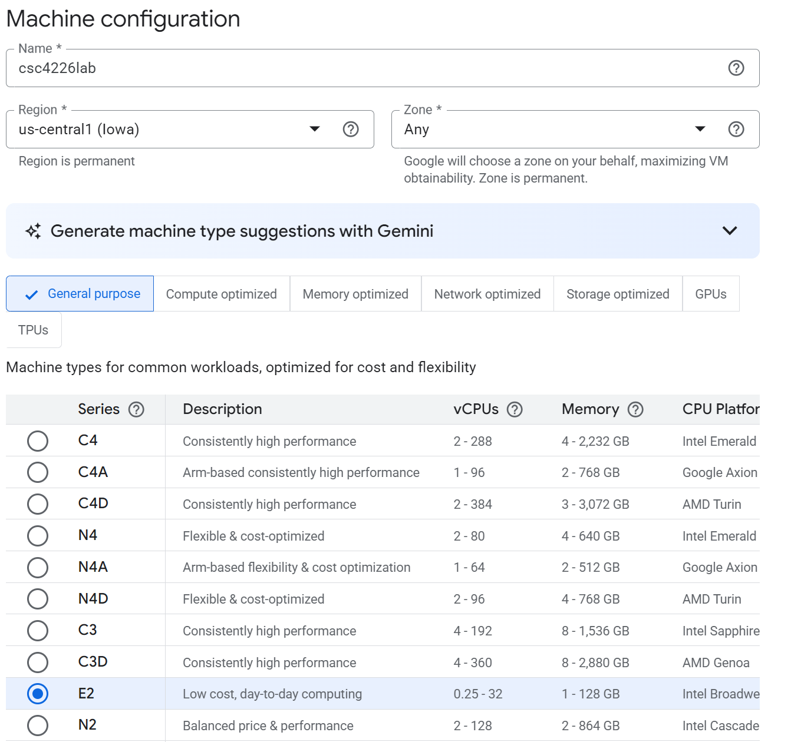
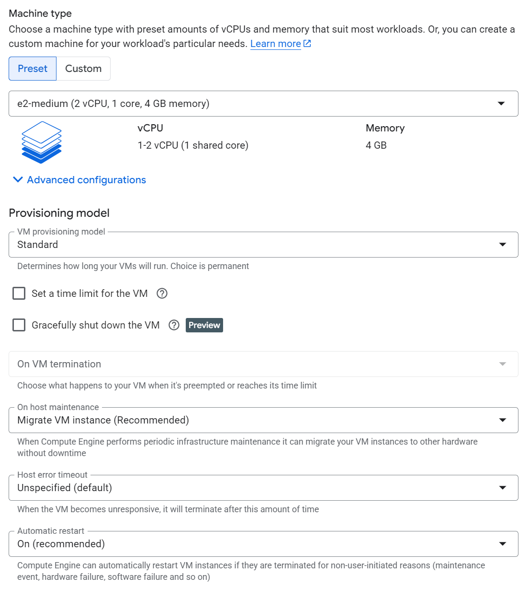
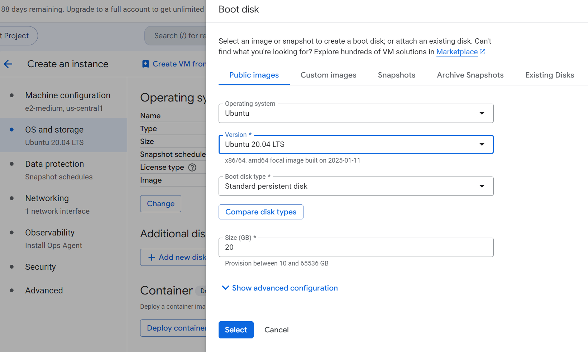
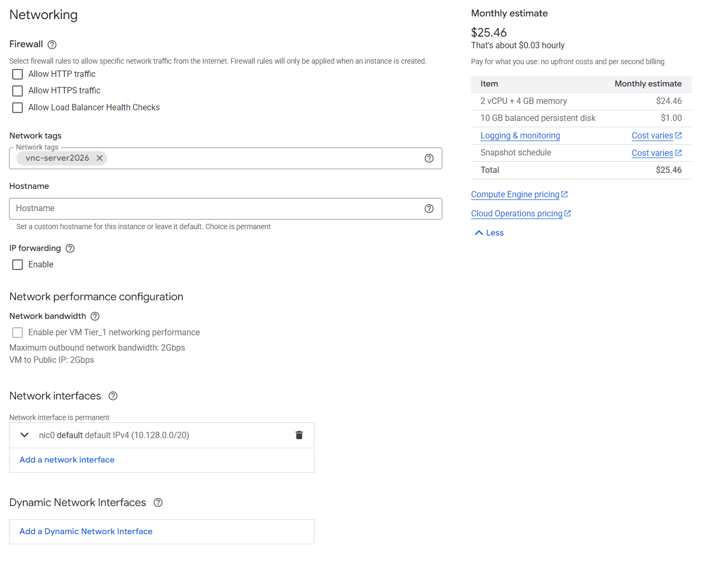
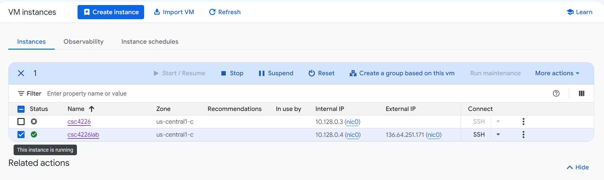
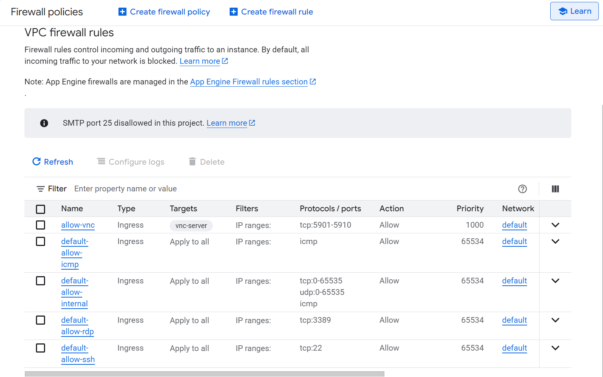
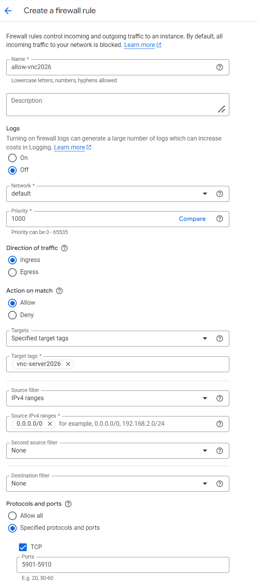

# Creating a VM Instance on Google Cloud

## Step 1: Register a free account

You can complete your free registration from the Google website [here](https://cloud.google.com/free?utm_source=google&utm_medium=cpc&utm_campaign=Cloud-SS-DR-GCP-1713658-GCP-DR-NA-US-en-Google-BKWS-EXA-GeneralGCP&utm_content=c-Hybrid+%7C+BKWS+-+EXA+%7C+Txt-Generic+Cloud-Cloud+Generic-Cloud+Generic-6458750523&utm_term=google%20cloud&gclsrc=aw.ds&gad_source=1&gad_campaignid=23752515549&gclid=CjwKCAjwhZDUBhBGEiwAbi5bjkO1ry1Jx-hTk80lTEPQsbhVCPV-QtHbElYYPBFAQtrTU4LRYsKcnRoCopMQAvD_BwE). New customers will receive $300 bonus that is sufficient to complete the labs in this course. 

## Step 2: Create a VM instance 

<mark>Note:<mark> When you create the VM instance, a configuration of 2 vCPU and 4GB of memory is more desirable. However, 
1 vCPU and 2GB is sufficient for most labs in CSC4222 Secure Software Engineering. You can
easily change the machine configuration later after the machine
is created. 

- In the navigation menu, click "Marketplace". In the Marketplace, search for Ubuntu 20.04. You will find two versions. Choose the Ubuntu 20.04 LTS (Focal), then click "launch".


- You will come to the Machine Configuration. Follow the configuration setting below. 



- In the left navigation, set "OS and storage" to Ubuntu 20.04.
  <mark> Note: <mark> Do NOT use any versions newer than Ubuntu 20.04, since some labs may not be compatible. Also, make sure to choose the x86/64bit, amd64 version, rather than the arm64 version. 


- In the left navigation, set network tag in "Networking". Remember this tag name. You will need to use it in **Step 3**.
  
  
- Click "Create", then you will see the created VM on the VM instance page. You can click "start" to run the VM.
  

## Step 3: Set up Firewall Rules

You need to set up firewall rules, so you can connect to the VM from the 
outside. You can find detailed instructions from 
the [official Google document](https://cloud.google.com/vpc/docs/firewalls) 
and other online tutorials. 
There are two essential rules that we need to set, one for SSH (which is 
usually already set by the cloud), and the other is for VNC.
Their port numbers are described in the following: 

```
SSH: Allow ingress traffic to TCP port 22
VNC: Allow ingress traffic to TCP port 5901 - 5910
Note: VNC servers use port 5900 + N, where N is the display number.
```

- To set the Firewall Rules, start the VM and go to the navigation menu > VPC network > Firewall.
Check the default SSH, its TPC port should be 22 by default.



- Click the "Create firewall rule" on the top. Set the rule as below and the click "create".


## Step 4: Install Software and Configure System


When the Ubuntu 20.04 VM is built, a default username with the root privilege
will be created in the system. The actual name of the user is typically
chosen by the cloud operator. Most cloud platforms will provide
a method for you to SSH into this account. Please log into the VM, and do the followings:

- Step 4.a: Download [`src-cloud.zip`](https://seed.nyc3.cdn.digitaloceanspaces.com/src-cloud.zip)
  from the link or using the following command (if copy-and-paste does not work
  for your SSH client, you may have to type the command; make sure you type
  the URL correctly):
  ```
  curl -o src-cloud.zip https://seed.nyc3.cdn.digitaloceanspaces.com/src-cloud.zip
  ```

- Step 4.b: In order to unzip the file, we first need to install the `unzip` program
  using the following command. After that, unzip the file.
  ```
  sudo apt update
  sudo apt -y install unzip
  unzip src-cloud.zip
  ```

- Step 4.c: After unzipping the file, you will see a `src-cloud` folder.
  Enter this folder, and run the following command to install software
  and configure the system.
  ```
  ./install.sh
  ```

- <mark>**Note:**<mark> This shell script will download and install all the software needed for
  the SEED labs. The whole process will take a few minutes. Please
  don't leave, because you will be asked twice to make choices:

  - During the installation of Wireshark, you will be asked
    whether non-superuser should be able to capture packets.
    Select `No`.

  - During the installation of `xfce4`, you will be asked to
    choose a default display manager. Choose `LightDM`.


After the script finishes, a new account called `seed` is created.
We will use this account for all the labs, instead of the default one
created by the cloud. We intentionally did not set a password for this account,
so nobody can directly log into this account. We can switch to the `seed`
account using the following command (if you do not use `sudo`, the OS
will ask you to type the password, making it impossible to log in):
```
sudo su seed
```

## Step 5: Access the VM Using VNC

For most labs, being able to SSH into the VM should be sufficient.
Some labs do need to access GUI applications on the VM, such as
Firefox and Wireshark. If your network bandwidth is not too
bad, being able to get a graphical desktop of the remote VM is
always more desirable than getting a text terminal via SSH.
We will use VNC (Virtual Network Computing) to get the remote
desktop.

- **On the cloud VM:** We need to make sure that we are in
  the `seed` account. If you are still in the default account, do
  the following, and you will be in the `seed` account:
  ```
  sudo su seed
  ```

  Our installation script has already installed
  the TigerVNC server program on the VM. You need to start the
  server.
  ```
  vncserver -localhost no
  ```  

  By default, TigerVNC server only listens to localhost/127.0.0.1. The
  purpose of the `-localhost no` option means accepting access from the
  outside. When we first start the `vncserver`, we will be asked to provide a
  password. Make sure this password is strong enough. Moreover, VNC
  communication itself is not encrypted, so you should not send anything
  personal. If you do want to secure it, you can run an SSH tunnel or VPN
  tunnel to protect the VNC communication.

- **On your computer:** You need to have a VNC viewer installed
  on your computer, such as [TigerVNC](https://tigervnc.org/), and
  [RealVNC](https://www.realvnc.com/en/connect/download/viewer/).
  If you prefer other VNC viewers,
  it is fine. Most of them are compatible with one another.
  Some users have reported that TigerVNC have issues on macOS,
  but RealVNC has no problem.

  Start your VNC viewer program, and type the IP address of the VM, along with
  the port number, such as `35.236.203.131:5901`. Most cloud VMs have two
  IP addresses; make sure you use the external IP address, not the internal
  one. You will be prompted for password, which is the one you typed
  when you first run the VNC server. If everything is done correctly,
  you will see the desktop of your remote VM.

  


